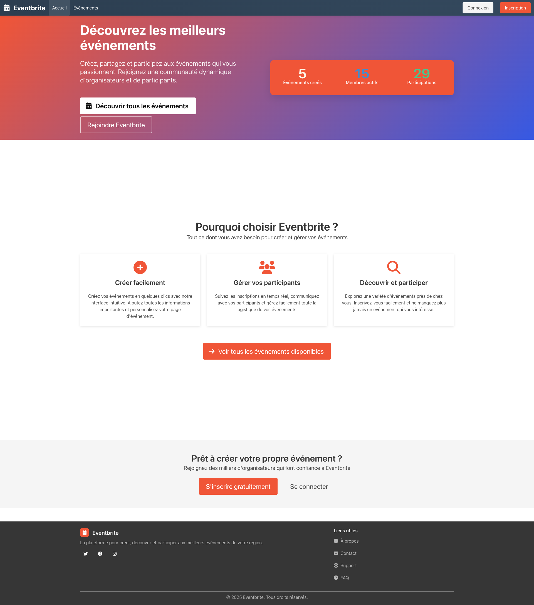
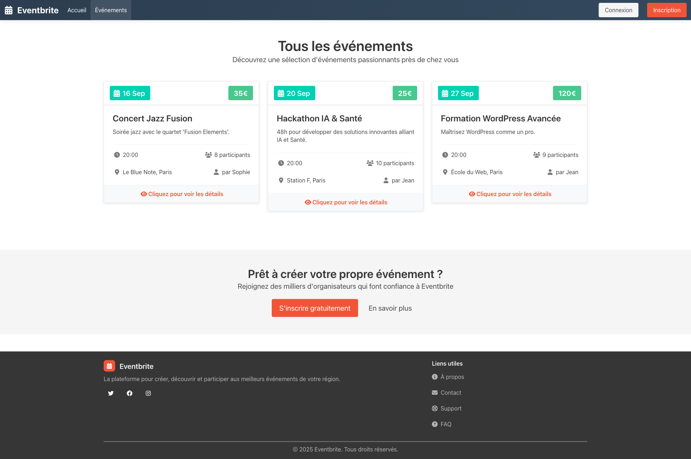
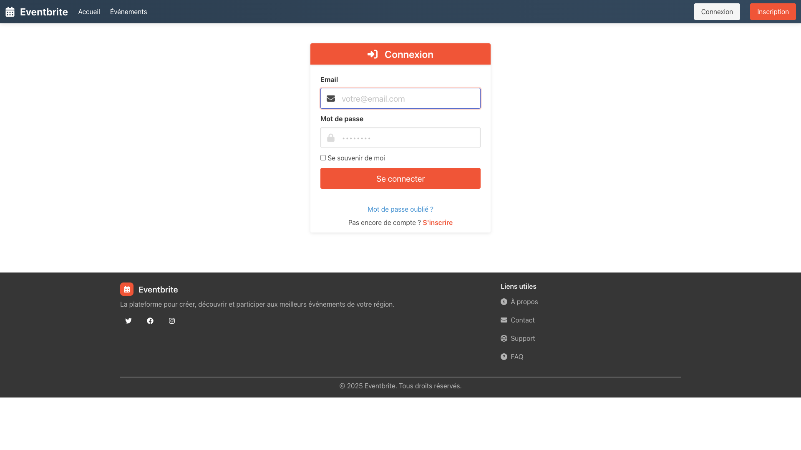
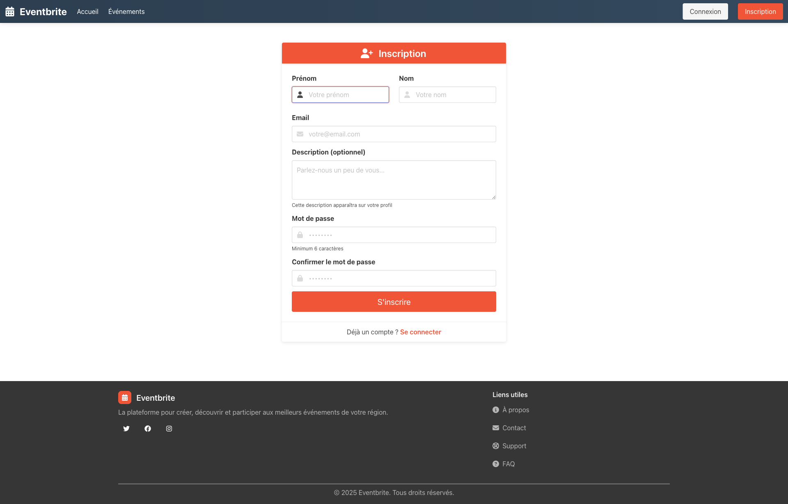
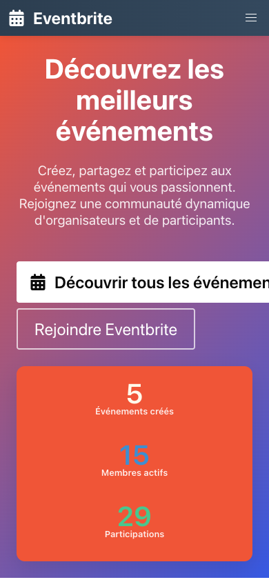
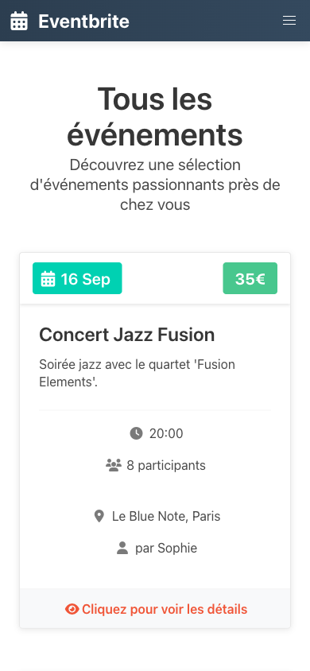

# Eventbrite Clone - Discover Amazing Events!

## Overview

Welcome to **Eventbrite Clone** - a modern event management platform built with Ruby on Rails where organizers can create events and participants can discover and join amazing experiences! Create workshops, parties, conferences, or any gathering you can imagine! 🎉

Perfect for learning Rails while building a real-world application that brings people together!

### **For Event Organizers**

- **Create Events**: Set up detailed events with dates, prices, and locations
- **Manage Participants**: View who's attending your events
- **Edit & Update**: Modify event details anytime
- **Track Success**: See participation statistics
- **Email Notifications**: Automatic emails when someone joins

### **For Event Participants**

- **Discover Events**: Browse through exciting upcoming events
- **Join Events**: One-click registration with secure payment tracking
- **Profile Management**: Update your information and preferences
- **Modern Interface**: Beautiful, responsive design with Bulma CSS
- **Personal Dashboard**: View your created events and participations

## 🚀 Quick Start

### Prerequisites

- Ruby 3.4.5+
- Rails 8.0.2+
- Basic terminal knowledge
- A love for events! 🎊

### Installation

1. **Clone the project**

   ```bash
   git clone [your-repo-url]
   cd Eventbrite_clone
   ```

2. **Install dependencies**

   ```bash
   bundle install
   ```

3. **Setup database**

   ```bash
   rails db:create
   rails db:migrate
   rails db:seed
   ```

4. **Start the server**

   ```bash
   rails server
   ```

5. **Visit your app** Open `http://localhost:3000` in your browser and start exploring! 🚀

## 🎭 Demo Data

After running the seed, you'll have:

- **5 Demo Users** with realistic French names and emails
- **10+ Sample Events** including workshops, concerts, and meetups
- **Random Participations** to see the platform in action

Login with any user using:

- **Email**: `user1@yopmail.com` to `user5@yopmail.com`
- **Password**: `password123`

## 🏗️ Architecture & Data Flow

The platform connects **event organizers** with **participants** through a robust Rails architecture:

### 🎯 Core Models Relationship

```text
👤 Users ────┬──→ 📅 Events ────┬──→ 🎟️ Attendances ───→ 💳 Payments
             │       (creator)   │       (join)          │      (Stripe)
             │                   │                       │
             │                   ├──→ 🛡️ Admin Panel     └───→ 🏦 Secure
             │                   │    (validation)              Processing
             │                   │
             │                   └──→ 📊 Statistics
             │                        (participants)
             │
             └──→ 👥 Event Participation
                  (through Attendances)
```

### 🔄 User Journey Flow

```text
Registration → Browse Events → Join Event → Payment → Confirmation
      ↓              ↓             ↓          ↓           ↓
   👤 User      📋 Event List  🎟️ Attend   💳 Stripe  📧 Email
```

**Key Features:**
- **🔐 Devise Authentication** - Secure user management
- **💳 Stripe Integration** - Safe payment processing  
- **🛡️ Admin Validation** - Event moderation system
- **📧 Email Notifications** - Automated communications
- **📱 Responsive Design** - Mobile-first approach

</details>

## 📸 Screenshots

### 🖥️ Desktop Version

### 🏠 Homepage
<div align="center">


*Clean homepage design with event statistics and navigation*

</div>

### 📋 Events List
<div align="center">


*Browse all available events with beautiful cards layout*

</div>

### 🔐 User Authentication
<div align="center">

<table>
<tr>
<td width="50%" align="center">


*Clean login form with Bulma styling*

</td>
<td width="50%" align="center">


*User-friendly registration process*

</td>
</tr>
</table>

</div>

### 📱 Mobile Responsive Design

<div align="center">

<table>
<tr>
<td width="50%" align="center">


*Homepage perfectly optimized for mobile devices*

</td>
<td width="50%" align="center">


*Events listing with mobile-first responsive design*

</td>
</tr>
</table>

> 💡 **Responsive Design**: The application automatically adapts to different screen sizes, ensuring optimal user experience on desktop, tablet, and mobile devices.

</div>

---

**Built with 💝 as part of learning Ruby on Rails!**

🎉 _"Every great event starts with someone brave enough to organize it"_ ✨

**Ready to create your next amazing event? Let's get started!** 🚀
